# 📸 AI Smart Event Photo Sorter


**An intelligent, high-performance AI system designed to automate the sorting of event photography based on facial recognition.**

Unlike basic face detection scripts, this project utilizes a **Dual-Engine Architecture** to handle both low-resolution social media thumbnails and high-resolution 4K professional camera shots simultaneously, ensuring maximum accuracy and recall across diverse image sources.

---

## 🚀 Key Features

### ⚡ Dual-Engine Processing
Automatically routes images to the appropriate detection engine based on resolution:
- **Small Engine (320×320):** Optimized for thumbnails and low-res images (< 800px)
- **HD Engine (640×640):** Designed for 4K/DSLR images to preserve fine facial details (≥ 800px)

### 🧠 GPU Acceleration
Fully optimized for NVIDIA GPUs using CUDA 12.4 & cuDNN v9 for lightning-fast inference. Automatically falls back to CPU if GPU is unavailable.

### 🛡️ Quality Gate
Automatically filters out blurry, distant, or low-quality background faces (detection score < 0.6) to keep the dataset clean and reduce false positives.

### 🎯 Strict Sorting
- **Strict Threshold:** 0.45 similarity for high-precision matching
- **Doubt Zone:** 0.3-0.45 similarity triggers AI Rescue (GFPGAN) for uncertain matches
- **Unknown Isolation:** Unrecognized faces are automatically moved to `Unknown` folder for manual review

### 🚑 AI Rescue (GFPGAN)
Integration logic for GFPGAN face restoration to recover and recognize doubtful faces in the uncertainty zone, improving recall without sacrificing precision.

---

## 🛠️ System Architecture

### Workflow Diagram

```mermaid
graph TD
    A[Input: New Photos Folder] --> B{Check Image Resolution}
    B -- Max Dimension < 800px --> C[Small Engine<br/>det_size: 320×320]
    B -- Max Dimension ≥ 800px --> D[HD Engine<br/>det_size: 640×640]
    C --> E[Face Detection & Embedding Extraction]
    D --> E
    E --> F{Quality Gate<br/>det_score ≥ 0.6?}
    F -- No --> G[Skip Face]
    F -- Yes --> H[Compare with Known People]
    H --> I{Similarity Score}
    I -- Score ≥ 0.45 --> J[✅ Clear Match]
    I -- 0.3 ≤ Score < 0.45 --> K[🚑 AI Rescue: GFPGAN]
    I -- Score < 0.3 --> L[❓ Unknown]
    J --> M[Copy to Person Folder]
    K --> N[Restore Face & Re-detect]
    N --> O{New Score ≥ 0.45?}
    O -- Yes --> M
    O -- No --> L
    L --> P[Move to 'Unknown' Folder]
```



### Processing Pipeline

1. **Image Loading:** Reads images from `Data/new_photos/`
2. **Smart Routing:** Analyzes image dimensions and selects appropriate engine
3. **Face Detection:** Extracts face embeddings using InsightFace (buffalo_l model)
4. **Quality Filtering:** Removes low-confidence detections
5. **Matching:** Compares embeddings with known people database
6. **Classification:** Routes to person folder, Unknown, or AI Rescue
7. **Output:** Organized photos in `Data/output/{PersonName}/`

---

## 📁 Project Structure

```
FaceSortingProject/
├── src/
│   ├── enroll.py              # Register known people (creates embeddings.pkl)
│   ├── process_photos.py      # Main processing script (Dual-Engine)
│   └── debug.py               # Diagnostic tool for testing detection configs
├── Data/
│   ├── known_people/          # Reference photos of known people
│   │   ├── Person1.jpg
│   │   ├── Person2.jpg
│   │   └── ...
│   ├── new_photos/           # Event photos to be sorted
│   ├── output/               # Sorted photos organized by person
│   │   ├── Person1/
│   │   ├── Person2/
│   │   └── Unknown/
│   └── embeddings.pkl        # Face embeddings database (generated)
├── requirements.txt           # Python dependencies
└── README.md                  # This file
```

---

## ⚙️ Configuration

| Parameter | Value | Description |
|-----------|-------|-------------|
| **Strict Threshold** | 0.45 | Minimum similarity for clear match (high precision) |
| **Doubt Threshold** | 0.3 | Lower bound for uncertainty zone (triggers AI Rescue) |
| **Quality Gate** | 0.6 | Minimum detection confidence score to process face |
| **Engine Switch** | 800px | Resolution threshold for Small/HD engine routing |
| **Small Engine** | 320×320 | Detection size for low-res images |
| **HD Engine** | 640×640 | Detection size for high-res images |
| **Model** | buffalo_l | InsightFace model pack (most accurate) |

---

## 📦 Installation

### Prerequisites

- **Python 3.10+**
- **NVIDIA GPU** with CUDA 12.4+ (optional, falls back to CPU)
- **cuDNN v9** (for GPU acceleration)

### Step 1: Clone Repository

```bash
git clone https://github.com/Saif-Alqdessi/FaceSortingProject.git
cd FaceSortingProject
```

### Step 2: Create Virtual Environment

```bash
python -m venv venv
```

**Windows:**
```bash
venv\Scripts\activate
```

**Linux/Mac:**
```bash
source venv/bin/activate
```

### Step 3: Install Dependencies

```bash
pip install -r requirements.txt
```

### ⚠️ Critical: Fix Library Conflicts

Some libraries may have version conflicts. Run these commands **after** installing requirements:

```bash
pip install "numpy<2"
pip install "opencv-python<4.10"
```

This ensures compatibility with InsightFace and prevents runtime errors.

### Step 4: CUDA Setup (Optional, for GPU)

If using GPU acceleration:

1. **Install CUDA Toolkit 12.4+** from [NVIDIA](https://developer.nvidia.com/cuda-downloads)
2. **Install cuDNN v9** from [NVIDIA cuDNN](https://developer.nvidia.com/cudnn)
3. **Verify Installation:**
   ```bash
   python -c "import torch; print(torch.cuda.is_available())"
   ```

The script will automatically detect and use GPU if available, otherwise falls back to CPU.

---

## 🎯 Usage

### Step 1: Enroll Known People

Place reference photos in `Data/known_people/` folder, naming each image with the person's name (e.g., `John_Doe.jpg`, `Jane_Smith.png`).

Run enrollment to create the embeddings database:

```bash
python src/enroll.py
```

**Output:**
- Creates `Data/embeddings.pkl` with face embeddings for all known people
- Processes both original and horizontally-flipped versions for better accuracy

### Step 2: Process Event Photos

Place event photos in `Data/new_photos/` folder.

Run the main processing script:

```bash
python src/process_photos.py
```

**Output:**
- Sorted photos in `Data/output/{PersonName}/` folders
- Unknown/unmatched photos in `Data/output/Unknown/`
- Detailed summary report with statistics

### Step 3: Review Results

Check the output folders and review the `Unknown` folder for any misclassifications or new people to add to the database.

---

## 📊 Performance Benchmarks

### Test Dataset
- **Size:** 3.31 GB
- **Image Count:** 474 images
- **Quality:** High Resolution (Average ~7 MB per image)
- **Source:** Mixed professional event photography

### Results
- **✅ Recall Rate:** 100% (All target people found)
- **❌ False Positive Rate:** 0%
- **⚡ Processing Speed:** ~2.4 images/second (Single GPU: NVIDIA RTX 3050 Ti)
- **🎯 Precision:** High (Strict threshold = 0.45)

### Performance Notes
- GPU acceleration provides ~3-5x speedup over CPU
- Dual-Engine architecture ensures optimal detection for both thumbnail and 4K images
- Quality gate reduces processing time by filtering low-confidence faces early

---

## 🔧 Troubleshooting

### Issue: "No faces detected"
- **Solution:** Check image quality and ensure faces are clearly visible
- Try running `src/debug.py` to test different detection configurations

### Issue: "CUDA out of memory"
- **Solution:** Process images in smaller batches or reduce `det_size` for HD engine

### Issue: Library conflicts
- **Solution:** Run the critical fix commands: `pip install "numpy<2"` and `pip install "opencv-python<4.10"`

### Issue: Low accuracy
- **Solution:** Ensure reference photos are high quality and clearly show the person's face
- Consider adjusting `STRICT_THRESHOLD` in `src/process_photos.py` (lower = more matches, higher = stricter)

---

## 🤝 Contributing

Contributions are welcome! Please feel free to submit a Pull Request.

---

## 📝 License

This project is open source and available under the MIT License.

---

## 🙏 Acknowledgments

- **InsightFace** for the state-of-the-art face recognition model
- **GFPGAN** for face restoration capabilities
- **NVIDIA** for CUDA and GPU acceleration support

---

## 📧 Contact

For questions or support, please open an issue on the GitHub repository.

---

**Built with ❤️ for event photographers and organizers**
